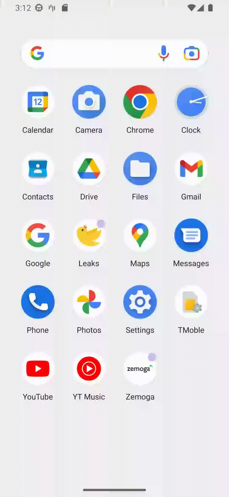
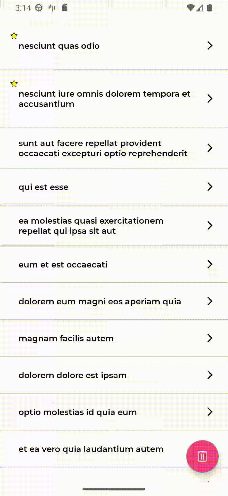
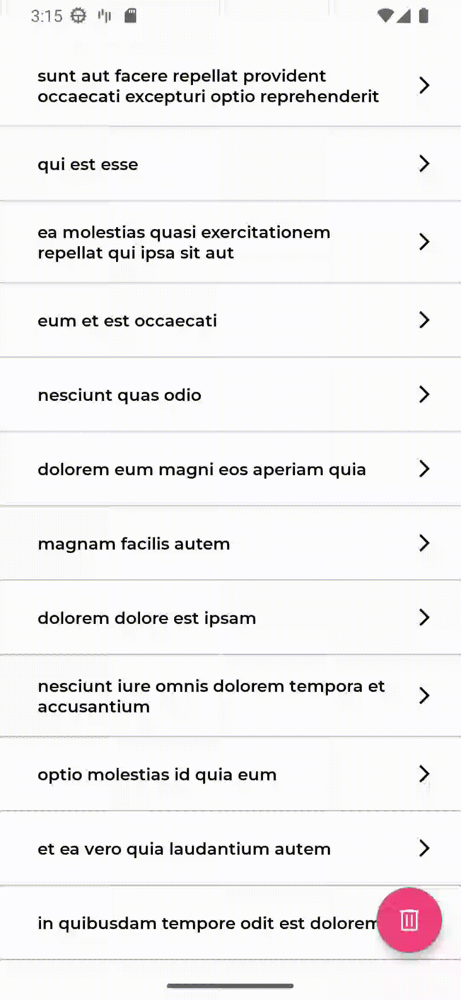
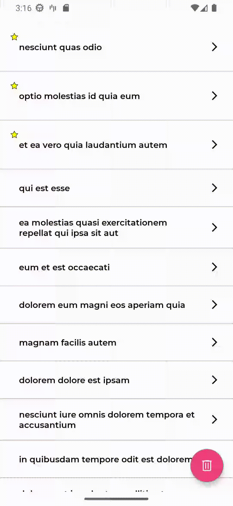

# Welcome to Android Zemoga Tech Test!

## What's included

An Android app with _modular architecture_ and _MVVM_ architectural pattern.


Furthermore, some libraries and frameworks such as:

* _Splash screen api_ and container _HomeActivity_.
* _Network connectivity interceptor_ for HTTP requests.
* _Hilt_ for dependencies injection.
* _Room_ for local storage.
* _Retrofit2_ for API requests.
* _Paging3_ for local & remote data pagination.
* _RemoteMediator_ for pagination orchestration.
* _Coroutines_ and _Flow_ for Reactive Functional Programming.
* _LiveData_ for observing and updating data.
* _ViewBinding_ for activities and fragments.
* _Timber_ for logging purposes.
* Android Studio _EditorConfig_ file to maintain consistent coding styles.
* Gradle’s Kotlin _DSL_.
* _SonarCloud_ for static code analysis.
* _SonarQube_ configuration files.
* _JaCoCo_ maven plugin to generate test coverage reports.
* _ktlint_ for static code analysis.
* _LeakCanary_ for memory leaks detection.
* _Github_ workflows for automated PR actions and Firebase app distribution.
* _Azure DevOps Pipelines_ workflows for automated PR actions.
* _dokka_ for Kotlin's documentation generation.

To summarize, every technology mentioned above was included in this project in order to meet the following requirements:

1. Load posts from JSON API, using both _start and _limit query parameters to support pagination (e.g. jsonplaceholder.typicode.com/posts?_start=0&_limit=10).
2. Show up swipe-to-options feature in posts recycler view items, allowing both delete a post and mark a post as favorite.
3. Favorite posts are shown up at the top of the list.
4. When a favorite post is unmarked as favorite, it returns to its previous position in the list.
5. Favorite posts have a star indicator. 
6. Delete all posts in posts list except from the favorite ones using a floating button. 
7. Fetching posts from JSON API when pull-to-refresh. 
8. Post details screen is opened up when a post is tapped.
9. Delete a post and mark a post as favorite in post details screen.
10. Show up post, author, and comments data in post details screen.
11. App is able to work offline, loading both posts lists and posts details from local database.

## Installation

Clone this repository and import it into **Android Studio**

```bash  
git clone https://github.com/JorgeDiazz/android-zemoga-tech-test.git  
```  

## Build variants

Herein you can find multiple targets that the app takes into account:

|          |Staging    |Production  |
|----------|-----------|------------|  
|`Internal`|Debug      |Debug       |
|`External`|Release     |Release    |

Where the following formed variants are built for staging purposes:

- stagingInternalDebug
- stagingInternalRelease

And these ones for production purposes:

- productionInternalDebug
- productionInternalRelease
- productionExternalDebug
- productionExternalRelease

**_Sidenote:_** choose productionExternalDebug before executing the app

## Debug app signing

In order to sign your debug app build using _debug-keystore.jks_ keystore, these are the credentials you will have to take in mind:

`STORE_FILE = ./app/debug-keystore.jks`

`STORE_PASSWORD = android`

`KEY_ALIAS = android_zemoga`

`KEY_PASSWORD = android`

## Others

1. Project's CodeStyle can be found [here](docs/codestyle.md).
2. Project utilities file can be found [here](docs/utilities.md).

## Using the app

### Launching the app


### Marking posts as favorite


### Unmarking posts as favorite


### Deleting posts


### Post details screen


### Marking posts as favorite in post details screen


### Deleting favorite post in post details screen


### Delete & refresh all non-favorite posts
