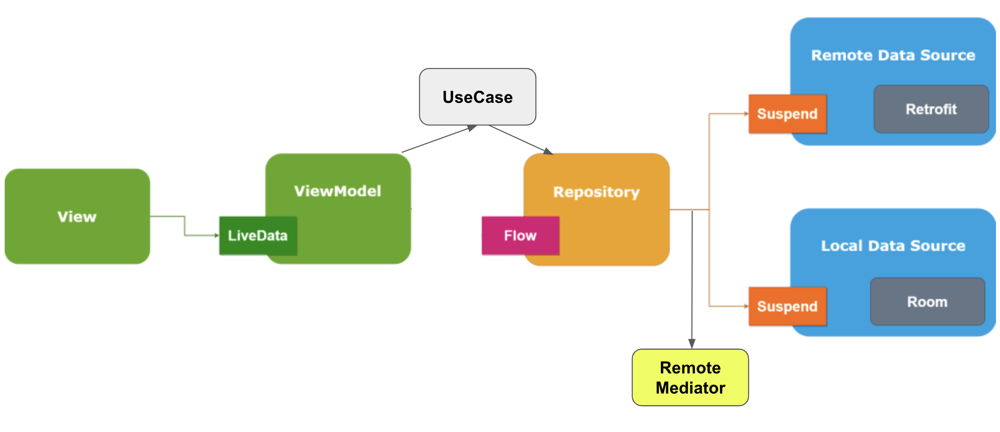
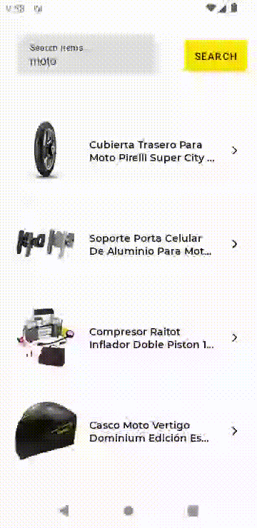
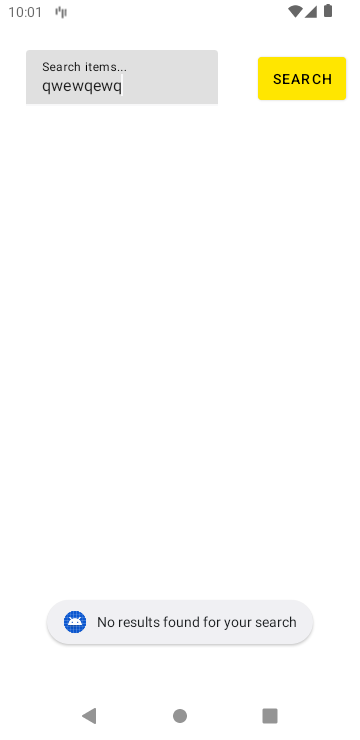
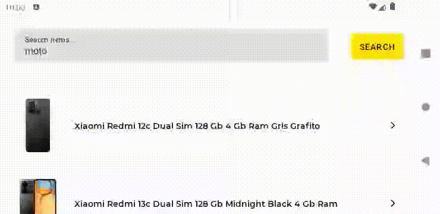

# Overview: Meli tech test (Android app)

Welcome to the Meli tech test, an Android application that utilizes the [MercadoLibre developers API](https://developers.mercadolibre.com.ar/es_ar/items-y-busquedas) to retrieve items and their details, providing a Mercado Libre app-like experience. 


## What's included

An Android app with _modular architecture_ and _MVVM_ architectural pattern.




Furthermore, some libraries and frameworks such as:

* _Splash screen api_ and container _HomeActivity_.
* _Network connectivity interceptor_ for HTTP requests.
* _Hilt_ for dependencies injection.
* _Room_ for local storage.
* _Retrofit2_ for API requests.
* _Paging3_ for local & remote data pagination.
* _RemoteMediator_ for pagination orchestration.
* _Coroutines_ and _Flow_ for Reactive Functional Programming.
* _StateFlow_ and _SharedFlow_ for observing and updating data.
* _ViewBinding_ for activities and fragments.
* _Timber_ for logging purposes.
* Android Studio _EditorConfig_ file to maintain consistent coding styles.
* Gradle’s Kotlin _DSL_.
* _ktlint_ for static code analysis.
* _LeakCanary_ for memory leaks detection.
* _dokka_ for Kotlin's documentation generation.
* _JUnit5_ and _Mockito_ for unit testing.

## Installation

Clone this repository and import it into **Android Studio**

```bash  
git clone https://github.com/JorgeDiazz/android-meli-tech-test.git  
```  

## Build variants

Herein you can find multiple targets that the app takes into account:

|          |Staging    |Production  |
|----------|-----------|------------|  
|`Internal`|Debug      |Debug       |
|`External`|Release     |Release    |

Where the following formed variants are built for staging purposes:

- stagingInternalDebug
- stagingInternalRelease

And these ones for production purposes:

- productionInternalDebug
- productionInternalRelease
- productionExternalDebug
- productionExternalRelease

## Debug app signing

In order to sign your debug app build using _debug-keystore.jks_ keystore, these are the credentials you will have to take in mind:

`STORE_FILE = ./app/debug-meli-keystore.jks`

`STORE_PASSWORD = android`

`KEY_ALIAS = meli-android`

`KEY_PASSWORD = android`

## Others

1. Project's CodeStyle can be found [here](docs/codestyle.md).
2. Project utilities file can be found [here](docs/utilities.md).

## Using the app

### Demo




### Empty state




### Landscape mode


